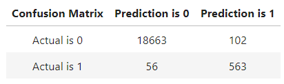
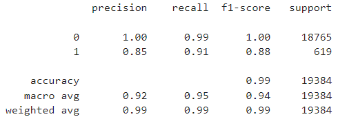

# Loan Risk Prediction Model Evaluation 

## Overview of the Analysis

### Purpose
Determine if is it possible to predict loan risk given the following information about a loan:
  * loan size
  * interest rate
  * borrower income
  * borrower debt-to-income ratio
  * borrower number of accounts
  * borrower number of negative items on credit report
  * borrower total debt

### Prediction Model Details
* The available data to create, train, and test the model includes 77,536 existing loans qualified as "healthy" or "high-risk". Unfortunately, the number of "high-risk" loans is much lower (2,500) in comparison to the "healthy" loans. 
* This exercise uses a classification model to create predictions; specifically, the Logistic Regression model with lbfgs solver from scikit-learn.
  * 75% of the overall data to train using scikit learn's train_test_split function which results in 56,271 "healthy" and 1,881 "high-risk" loans. i.e. "high-risk" loans make up 3.3% of the training data.
  * 25% of the overall data to train using scikit learn's train_test_split function which results in 18,765 "healthy" and 619 "high-risk" loans. i.e. "high-risk" loans make up 3.3% of the training data.
  * For repeatability, I am using a random state of 1. Using other random states will provide similar results but not exact.
  * Additional technical details about the model may be found on-line within ([scikit's documentation](https://scikit-learn.org/stable/modules/generated/sklearn.linear_model.LogisticRegression.html))

## Results

* scikit-learn Logistic Regression model with lbfgs solver:
  * Regarding "healthy" loans:
    * Out of all the loans that the model predicted a "healthy" loan, 100% (rounded) were "healthy" per the classification report
      * Referring to the confusion matrix, the 100% is really 99.7% (18,663/18,719) which is important to understand to align with the "high-risk" results (i.e., 0.3% of the loans predicted to be "healthy" were actually "high-risk")
    * the model correctly predicted 99% of the actual "healthy" loans (i.e., 1% of the "healthy" loans were predicted to be "high-risk")
  * Regarding "high-risk" loans:
    * Out of all the loans that the model predicted to be "high-risk", only 85% actually were "high-risk" (i.e., 15% of the loans predicted to be "high-risk" were actually "healthy")
    * the model correctly predicted 91% of the actual "high-risk" loans (i.e. 9% of the "high-risk" loans were predicted to be "healthy")
  * Overall this model provides 99% accuracy but due to the data available, that rating is heavily weighted to "healthy" loans.

Logistic Regression Confusion Matrix | Logistic Regression Classification Report 
:-------------------------:|:-------------------------:
  |  

## Summary

I recommend using the scikit-learn Logistic Regression model with lbfgs solver as a filter for how to spend time evaluating loan applications. If a future loan is predicted to be "healthy", little time should be spent digging into further detail prior to approving the loan because the likelihood that it will be healthy is 99+%. However, if the model predicts the loan to be "high-risk" and the potential benefit of that loan to the lender is relatively high, more time should be spent evaluating that loan against additional features because 15% of the test loans predicted to be "high-risk" were actually "healthy".

Another way to say it, is to use this model as a first pass to streamline accepting loans but do not depend on it for rejecting loans. If a loan is identified as "high-risk", spend more time looking into the details based on the value of that loan to the lender prior to rejecting it. 

# 
#
# Repo Notes

## File Notes
* credit_risk_classification.ipynb contains the code used for this analysis
* Resources/lending_data.csv contains the data used in this analysis
* The images folder contains images used in the analysis write-up

## References
* More explanation on the Classification Report: https://www.statology.org/sklearn-classification-report/ 
* Data for this dataset was generated by edX Boot Camps LLC, and is intended for educational purposes only.
 

## Getting Started

### Prerequisites
To run the jupyter notebook with the solution, you must have Python, jupyter notebook, pathlib, scikit-learn installed in your environment

### Cloning Repo
$ git clone https://github.com/vt-bekah/credit-risk-classification.git

$ cd credit-risk-classification

$ jupyter lab

## Built With
* Python v3.10.11
* jupyter notebook v6.5.2
* jupyterlab v3.6.3
* conda v23.5.0
* pathlib v1.0.1
* scikit-learn v1.2.2

**Python Modules**
* pandas v1.5.3
* numpy v1.24.3